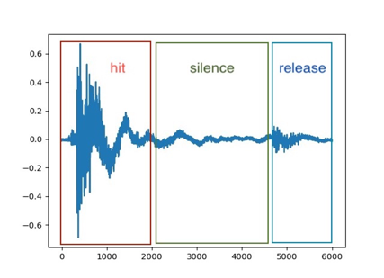
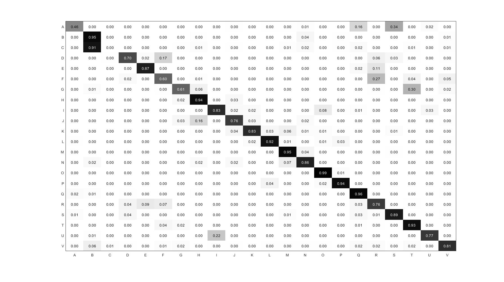
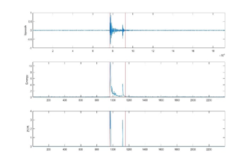
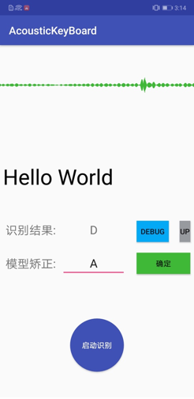

<h1 align="center"> 🔊⌨️ AcousticKeyBoard </h1>
<p align="center">
    <em> ❓脑洞大开：做一个能听懂键盘敲击键位的「玩具」，学习信号处理 / 深度学习 / 安卓 / Django。 </em>
</p>
<p align="center">
    <em> 基于声学信号处理及深度学习的键盘敲击识别系统。 </em>
</p>

<p align="center">
    
</p>


## 💡Ideas



*上图为完整的按键信号（采样率：48 kHz）。*

1）💥 脑洞

* 按键敲击最高世界记录约为 800 / min，平均每 75 ms 敲击一次键盘，即按键重叠发生在 3,600 的 silence 片段。
* 单人敲击键盘场景下，Hit 片段不会重合，并且**不同按键所处位置、形状有所区别，Hit 具有可识别特征**。
* 空格与其他按键形状不同，敲击声已明显不同。
* 不同按键周围的固体环境有差异，声音信号基于固体传导，在峰段存在差异。

2）📈 预测结果



*A-V，LSTM。*


## 🔍 Processing

1）有效信号提取（[Voice activity detection](https://en.wikipedia.org/wiki/Voice_activity_detection)）

*代码：[apps/keyboard/core/vad.py](https://github.com/ZhuoZhuoCrayon/AcousticKeyBoard-Web/blob/master/apps/keyboard/core/vad.py)*



2）降噪（[中值滤波，Median filter](https://en.wikipedia.org/wiki/Median_filter)）

3）特征提取（[梅尔频率倒谱系数，Mel-frequency cepstrum](https://en.wikipedia.org/wiki/Mel-frequency_cepstrum)）

*代码：[apps/keyboard/core/mfcc](https://github.com/ZhuoZhuoCrayon/AcousticKeyBoard-Web/tree/master/apps/keyboard/core/mfcc)*

4）训练

基于 [Tensorflow](https://www.tensorflow.org/learn) 搭建 LSTM 模型，在堆层数不多的情况已经达到比较好的效果。

```python
class LstmModel(BLstmModel):
    MODEL_NAME = constants.AlgorithmModel.LSTM

    def get_model(self, max_label_num: int, input_shape: Tuple[int], *args, **kwargs) -> tf.keras.Sequential:
        return tf.keras.models.Sequential(
            [
                tf.keras.layers.LSTM(units=100, return_sequences=False, input_shape=input_shape),
                tf.keras.layers.Dense(units=max_label_num, activation="softmax"),
            ]
        )
```

*代码：[apps/keyboard/core/algorithm](https://github.com/ZhuoZhuoCrayon/AcousticKeyBoard-Web/tree/master/apps/keyboard/core/algorithm)*


## 📦 Usage

预测：

```python
import numpy as np

from apps.keyboard import constants, models
from apps.keyboard.core.format import get_mfcc
from apps.keyboard.core.vad import vad

def predict(inst_id: int, signal: list) -> dict:
    model_inst = models.AlgorithmModelInst.objects.get(id=inst_id)
    
    # vad
    signal_np = np.asarray(signal, dtype=np.float64) / constants.TRANSFER_INT
    left, _ = vad(signal_np)
    
    # mfcc
    dataset = models.Dataset.objects.get(id=model_inst.dataset_id)
    mfcc_feature = get_mfcc(vec=signal_np[: dataset.length + 1], fs=dataset.fs)
    
    # predict
    tf_model = model_inst.load_model()
    scores = tf_model.model.predict(np.expand_dims(mfcc_feature, 0))
    return constants.ID_LABEL_MAP[np.argmax(scores)]
```

*更多：[apps/keyboard/handler/model_inst.py](https://github.com/ZhuoZhuoCrayon/AcousticKeyBoard-Web/blob/master/apps/keyboard/handler/model_inst.py)。*


## 🔧 Installation

### App



AcousticKeyBoard-Mobile 👉 [https://github.com/ZhuoZhuoCrayon/AcousticKeyBoard-Mobile](https://github.com/ZhuoZhuoCrayon/AcousticKeyBoard-Mobile)。

### Web

1）在 env 文件下创建 dc_dev.env 文件，导入环境变量。

```shell
SECRET_KEY=fixme
APP_NAME=ak-web-backend
APP_VERSION=v1
# RUN_ENV dev|stag|prod
DC_ENV=dev
# DB local
DC_MYSQL_NAME=root
DC_MYSQL_PASSWORD=
DC_MYSQL_HOST=localhost
DC_MYSQL_PORT=3306
# Redis local
DC_REDIS_HOST=localhost
DC_REDIS_PASSWORD=
DC_REDIS_PORT=6379
# user
DC_SUPER_USER_NAME=crayon
DC_SUPER_PASSWORD=123
AK_ROOT = **/AcousticKeyboard/AcousticKeyboard/in_python
```

2）创建 MySQL 数据库。

```sql
/* 注意修改成自己的APP_NAME */
CREATE DATABASE `ak-web-backend` DEFAULT CHARACTER SET utf8mb4 COLLATE utf8mb4_general_ci;
```

3）运行

```shell
# migrate
python manage.py migrate

# server
python manage.py runserver

# worker
celery-A djangocli worker-linfo 
```


## 📣Things to know

* 每个人敲击键盘习惯不同，泛化模型能力难度比较大。
* 学术价值有但不高，更多是基于这个 idea 进行学习。

